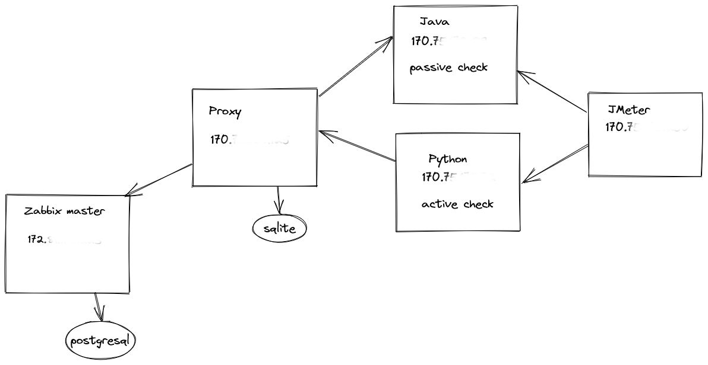
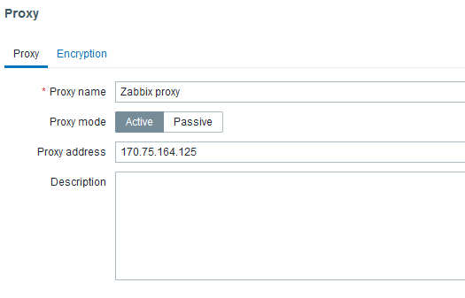
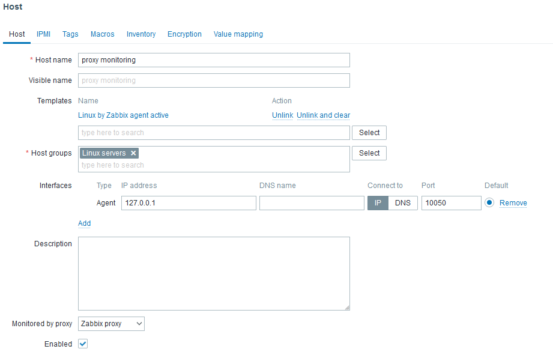
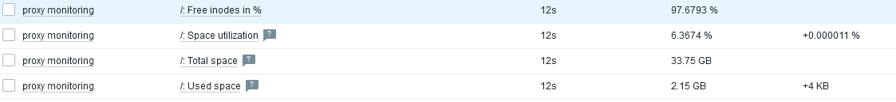

# Zabbix-ansible

Deployment of a zabbix Sandbox 



## Prerequisite - Ansible setup 
```shell
sudo apt update   # update all packages
sudo apt -y install python3-venv
sudo apt-get -y install git wget htop iotop iftop

#fork and clone ---> git clone https://github.com/crunchy-devops/zabbix-ansible.git
git clone https://github.com/<your_repo>/zabbix-ansible.git
cd zabbix-ansible
python3 -m venv venv # set up the module venv in the directory venv
source venv/bin/activate # activate the python virtualenv
pip3 install wheel # set for permissions purpose
pip3 install ansible # install ansible
ansible --version  # check version number , should be the latest 2.13.1+
```

## Create and propagate a ssh key
```shell
ssh-keygen -t rsa -b 4096   # sans passphrase
ssh-copy-id ubuntu@172.15x.xx  # propagate ssh key
```
`
## Inventory file 

```shell
[local]
localhost ansible_user=ubuntu  ansible_connection=local 
[master]
master01 ansible_host=172.xx.xx.xx ansible_user=ubuntu ansible_ssh_private_key=/home/ubuntu/.ssh/id_rsa
[proxy]
proxy01 ansible_host=170.xx.xx.xx ansible_user=ubuntu ansible_ssh_private_key=/home/ubuntu/.ssh/id_rsa
[agent]
java01 ansible_host=170.xx.xx.xx ansible_user=ubuntu ansible_ssh_private_key=/home/ubuntu/.ssh/id_rsa
python01 ansible_host=170.xx.xx.xx ansible_user=ubuntu ansible_ssh_private_key=/home/ubuntu/.ssh/id_rsa
cd zabbix-ansible 
```
## check the inventory file 
```ansible all -i inventory -m ping ```

## Install Zabbix Sandbox using ansible 
```shell
ansible-playbook -i inventory playbook.yml proxy.yml # run all playbooks
```
## Create a proxy in Zabbix web interface



## Set up a host which checks the sanity of the proxy host



## Check the latest data


